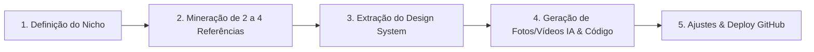

# 📘 Manual de Boas Práticas & Padrões de Engenharia da Agência

Este guia estabelece os **padrões de excelência técnica, visual, conversão (CRO), SEO e o fluxo operacional de benchmarking** para todos os projetos desenvolvidos na agência e no desafio dos **100 Sites em 100 Dias**.

---

## 🔄 1. O Fluxo de Trabalho Oficial (Benchmark -> Código -> Deploy)

Construir "do nada" gera layouts genéricos. O padrão oficial da agência segue sempre a cadeia de inteligência visual:



1. **Definição do Nicho do Dia**: Escolha do segmento de alto ticket.
2. **Mineração de Referências**: O usuário e a IA selecionam 2 a 4 sites reais com design de ponta.
3. **Extração de Design System**: A IA analisa as referências e extrai tipografia, paleta clara/escura, micro-interações e hierarquia de conversão.
4. **Construção & Ativos de IA**: Geração de fotos ultra-realistas dos especialistas, vídeos animados de evolução/produto e codificação em HTML5, CSS e JS puro.
5. **Validação & Deploy Contínuo**: Ajuste visual imediato no navegador e publicação no GitHub Pages.

---

## 🧭 2. Onde e Como Encontrar Referências de Elite (Mineração em 2 Minutos)

### A. Busca no Google Ads em Polos Nobres
Quem paga anúncios no Google Ads em polos de alto poder aquisitivo geralmente contratou agências de ponta (R$ 5k a R$ 25k).
- **Fórmula de Busca**: `[Nicho] + [Polo Nobre]`
  - *Exemplos*:
    - `"harmonizacao facial jardins sp"`
    - `"clinica dermatologia itaim bibi"`
    - `"imobiliaria alto padrao alphaville"`
    - `"energia solar empresarial curitiba"`
    - `"advocacia empresarial faria lima"`

### B. Biblioteca de Anúncios do Meta (Instagram / Facebook)
Permite visualizar landing pages reais e ativas que estão recebendo tráfego pago neste exato momento.
- **Link**: [facebook.com/ads/library](https://www.facebook.com/ads/library)
- **Como usar**: Selecione Brasil -> Todos os Anúncios -> Digite o Nicho -> Clique nos botões "Saiba Mais" para inspecionar as páginas de destino.

### C. Diretórios Globais de Design & UI
- **[Land-book.com](https://land-book.com/)**: Catálogo filtrado por nicho com as páginas mais bonitas do mundo.
- **[OnePageLove.com](https://onepagelove.com/)**: Foco em sites de página única e alta conversão.
- **[Awwwards.com](https://www.awwwards.com/)**: Sites premiados mundialmente por estética e interatividade.
- **[Dribbble.com](https://dribbble.com/)**: Buscar `[Nicho] landing page ui` (ex: `Dental clinic landing page`).

---

## 🏛️ 3. Pilares de Design & Estética Visual

1. **Tipografia de Alto Nível (Nunca usar fontes padrão)**:
   - **Títulos (Headings)**: Fontes com personalidade e autoridade.
     - *Nichos Clássicos / Luxo / Jurídico*: `Cormorant Garamond`, `Cinzel`, `Playfair Display`.
     - *Nichos Modernos / Saúde / Imobiliário / Tech*: `Plus Jakarta Sans`, `Outfit`, `Inter`.
   - **Corpo de Texto (Body)**: Alta legibilidade técnica com contraste mínimo de `4.5:1` (WCAG AA).
2. **Harmonia de Cores & Design Tokens**:
   - Definir sempre variáveis CSS (`:root`) para cores primárias, superfícies, bordas e acentos.
   - **Paletas Claras de Luxo**: Tons como *Warm Alabaster* (`#f9f7f2`), *Linen* (`#f1ede3`), *Pure White* (`#ffffff`), com acentos nobres em *Ouro Brunido* (`#9e7b3b`) ou *Navy Charcoal* (`#11161f`).
   - **Micro-interações Suaves**: Transições com `cubic-bezier(0.16, 1, 0.3, 1)` em hovers, elevação sutil de cards (`translateY(-4px)`), e foco iluminado em fotos.

---

## 🎬 4. Vídeos Animados com IA & Transições Visuais (O Diferencial de Alto Valor)

A imagem estática comunica autoridade, mas o **vídeo com movimento e transição de tempo retém a atenção e fecha vendas**.

### A. Princípios de Aplicação de Vídeo
1. **Vídeos de Transformação / Time-Lapse (Antes & Depois com IA)**:
   - Gerar os frames de transição no Google Vids / Veo AI mostrando a evolução gradual (ex: rejuvenescimento facial, cura de melasma, restauração capilar).
   - Sem textos poluidos ou narração robotizada: foco total na evolução visual da face ou produto.
2. **Vídeos de Fundo Ambientais (Ambient Background Loop)**:
   - Vídeos curtos (5 a 10s) em loop contínuo e silencioso com sobreposição escura/gradiente para destacar textos e CTAs.
3. **Alternador de Modos (Slider Interativo + Vídeo Time-Lapse)**:
   - Sempre oferecer ao visitante a escolha: interagir manualmente arrastando o slider OU assistir ao vídeo de transformação contínua.

### B. Boas Práticas Técnicas de Implementação em HTML5
* **Atributos Obrigatórios para Mobile**:
  ```html
  <video autoplay loop muted playsinline poster="assets/capa.jpg">
    <source src="assets/video.mp4" type="video/mp4">
  </video>
  ```
* **Performance & Lazy Loading**:
  - `muted` e `playsinline` são mandatórios para que o vídeo dê autoplay no Safari (iOS) e Chrome (Android).
  - Sempre incluir `poster` para carregar instantaneamente enquanto o buffer do vídeo é montado.
  - Comprimir o `.mp4` para manter o peso otimizado (< 4MB) e preservar a pontuação 90+ no Google PageSpeed.

---

## 🚀 5. Engenharia de Conversão (CRO) & WhatsApp

1. **O Humano como Alma do Site**:
   - Sempre destacar os profissionais titulares/fundadores com fotos verticais de alta qualidade e credenciais visíveis.
2. **Formulários Dinâmicos com Redirecionamento Inteligente**:
   - Todo diagnóstico ou simulador deve gerar uma mensagem estruturada com marcadores (`👤 Nome:`, `🏢 Empresa:`, `⚖️ Necessidade:`) enviada direto para o WhatsApp do responsável.
3. **Múltiplos Pontos de Contato Não Invasivos**:
   - Botão de WhatsApp no Header (plantão).
   - Botão principal no Hero (primeira dobra).
   - Botão flutuante fixo no canto inferior direito com foto do profissional e status "Online".

---

## 🔍 6. SEO Técnico & Estruturação Semântica

1. **Marcação Semântica Única**:
   - Apenas **um único `<h1>` por página** contendo a palavra-chave principal e a proposta de valor.
   - Hierarquia estrita: `<h1>` -> `<h2>` -> `<h3>` -> `<h4>`.
2. **Dados Estruturados Schema.org JSON-LD**:
   - Implementar em todas as páginas o schema correto para o Google indexar com rich snippets:
     - Advocacia: `LegalService` & `Attorney`
     - Clínicas/Médicos: `MedicalBusiness` & `Physician`
     - Imobiliárias: `RealEstateAgent`
     - Garagens de Carros: `AutoDealer`
     - Lojas Virtuais: `Store` & `Product`
3. **Meta Tags Completas**:
   - `title` descritivo (< 60 caracteres).
   - `meta description` atrativa com chamada para ação (< 155 caracteres).
   - OpenGraph tags (`og:title`, `og:description`, `og:image`, `og:type`).

---

## ⚡ 7. Performance & Core Web Vitals

1. **Meta de Velocidade**:
   - Google PageSpeed Insights **90+ no Mobile e Desktop**.
   - LCP (Largest Contentful Paint) < 2.5s.
   - CLS (Cumulative Layout Shift) < 0.1.
2. **Otimização de Mídia**:
   - Imagens no formato correto (`.webp` ou `.jpg` comprimido) com dimensões adequadas.
   - Atributos `alt` descritivos em 100% das imagens.
   - Carregamento assíncrono de scripts com `IntersectionObserver` para contadores e animações.

---

## 🛡️ 8. Conformidade Ética & Regulamentações por Nicho

- **Advocacia (OAB)**: Respeitar o Provimento nº 205/2021 da OAB (caráter informativo, sem mercantilização agressiva ou promessa de causa ganha).
- **Medicina / Odonto (CFM / CFO)**: Indicação clara de CRM/CRO e RQE (registro de qualificação de especialista), sem fotos apelativas ou promessas milagrosas.
- **LGPD (Lei Geral de Proteção de Dados)**: Aviso de privacidade transparente abaixo de formulários e sigilo estrito de dados captados.

---

## 🔄 9. Fluxo de Git & Deploy Profissional

1. **Padrão Conventional Commits**:
   - `feat(modulo):` para novas funcionalidades.
   - `style(modulo):` para alterações visuais e CSS.
   - `fix(modulo):` para correções de bugs.
   - `docs(modulo):` para documentação.
2. **Deploy Automatizado**:
   - Toda alteração aprovada é enviada via `git push origin main` e atualizada no GitHub Pages.

---

## ✅ 10. Checklist Pré-Entrega (10 Passos antes de publicar)

- [ ] 1. O site abre perfeitamente no celular (testar em iPhone e Android)?
- [ ] 2. Nenhum elemento ficou sobreposto no menu ou no rodapé?
- [ ] 3. Todos os links de WhatsApp abrem a conversa com o número e mensagem corretos?
- [ ] 4. Há apenas um `<h1>` na página?
- [ ] 5. As imagens e vídeos têm descrições no atributo `alt` e `poster`?
- [ ] 6. O Schema.org JSON-LD está validado sem erros?
- [ ] 7. Os números animados (count-up) disparam suavemente na rolagem?
- [ ] 8. As máscaras de formulário (telefone/DDD) funcionam sem travar?
- [ ] 9. O contraste de cores é nítido e confortável para leitura?
- [ ] 10. O commit foi feito com mensagem clara e enviado para o GitHub?
